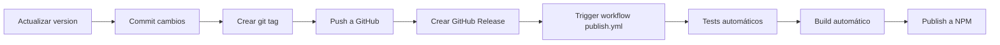

# Release & Publish Automation Guide

Este documento explica cómo está configurada la automatización de publicación a NPM cuando se crea un GitHub Release.

## 🔄 Workflow Automático

El archivo `.github/workflows/publish.yml` se ejecuta automáticamente cuando:
- Se crea un nuevo **GitHub Release**
- El release tiene el estado **published**

### ¿Qué hace el workflow?

1. ✅ Ejecuta todos los tests
2. ✅ Compila el proyecto
3. ✅ Publica a NPM con `--provenance` (verificación de origen)
4. ✅ Publica con acceso público

---

## 🔐 Configuración Inicial (Una sola vez)

### Paso 1: Generar NPM Token

1. Ve a: https://www.npmjs.com/settings/weppa-cloud/tokens
2. Click en "Generate New Token" → **Automation**
3. Copia el token generado (solo se muestra una vez)

### Paso 2: Agregar Token a GitHub Secrets

1. Ve a: https://github.com/weppa-cloud/material3-mcp-server/settings/secrets/actions
2. Click en "New repository secret"
3. Name: `NPM_TOKEN`
4. Secret: Pega el token de NPM
5. Click "Add secret"

### Paso 3: Verificar Configuración

Una vez configurado el secret, el workflow estará listo. Puedes verificarlo en:
https://github.com/weppa-cloud/material3-mcp-server/settings/secrets/actions

---

## 📦 Proceso de Release

### Opción 1: Release Manual (Recomendado)

```bash
# 1. Actualizar versión en package.json
# Edita manualmente: "version": "1.2.0"

# 2. Commit y push
git add package.json
git commit -m "chore: bump version to 1.2.0"
git push origin main

# 3. Crear tag
git tag v1.2.0
git push --tags

# 4. Crear GitHub Release
gh release create v1.2.0 \
  --title "v1.2.0 - Descripción breve" \
  --notes "## What's New

- Feature 1
- Feature 2
- Bug fixes

**Full Changelog**: https://github.com/weppa-cloud/material3-mcp-server/compare/v1.1.0...v1.2.0"
```

### Opción 2: Script Automatizado

Usa el script `scripts/release.sh`:

```bash
./scripts/release.sh 1.2.0 "Nueva versión con mejoras"
```

---

## 🎯 Flujo Completo de Publicación



### Tiempo estimado
- Manual: ~2 minutos
- Automático (después del release): ~1 minuto

---

## ✅ Verificación Post-Publicación

Después de crear el GitHub Release:

1. **Ver workflow en acción:**
   - https://github.com/weppa-cloud/material3-mcp-server/actions

2. **Verificar en NPM:**
   ```bash
   npm view @weppa-cloud/material3-mcp-server version
   ```

3. **Probar instalación:**
   ```bash
   npx @weppa-cloud/material3-mcp-server@latest
   ```

---

## 🔧 Troubleshooting

### El workflow no se ejecuta

**Problema:** El release no triggerea el workflow
**Solución:**
- Verifica que el release esté marcado como "published" (no "draft")
- El tag debe seguir el formato `vX.Y.Z` (ej: `v1.2.0`)

### Falla la publicación

**Problema:** `npm publish` falla en el workflow
**Soluciones:**
1. Verifica que `NPM_TOKEN` esté configurado correctamente
2. Verifica que el token tenga permisos de "Automation"
3. Verifica que la versión en `package.json` no esté ya publicada
4. Revisa los logs en: https://github.com/weppa-cloud/material3-mcp-server/actions

### Error de permisos

**Problema:** `Error: 403 Forbidden`
**Solución:**
- El token NPM puede haber expirado
- Regenera el token y actualiza el secret en GitHub

---

## 📋 Checklist Pre-Release

Antes de crear un release, verifica:

- [ ] Todos los tests pasan localmente (`npm test`)
- [ ] El build funciona (`npm run build`)
- [ ] La versión en `package.json` fue actualizada
- [ ] El CHANGELOG está actualizado (opcional)
- [ ] Los cambios están pusheados a `main`
- [ ] El tag git fue creado y pusheado

---

## 🚀 Ejemplos de Releases

### Patch Release (1.1.0 → 1.1.1)
```bash
# Cambios en package.json: "version": "1.1.1"
git add package.json
git commit -m "chore: bump version to 1.1.1"
git tag v1.1.1
git push && git push --tags
gh release create v1.1.1 --title "v1.1.1 - Bug fixes" --notes "Bug fixes"
```

### Minor Release (1.1.0 → 1.2.0)
```bash
# Cambios en package.json: "version": "1.2.0"
git add package.json
git commit -m "chore: bump version to 1.2.0"
git tag v1.2.0
git push && git push --tags
gh release create v1.2.0 --title "v1.2.0 - New features" --notes "New features..."
```

### Major Release (1.1.0 → 2.0.0)
```bash
# Cambios en package.json: "version": "2.0.0"
git add package.json
git commit -m "chore: bump version to 2.0.0 - BREAKING CHANGES"
git tag v2.0.0
git push && git push --tags
gh release create v2.0.0 --title "v2.0.0 - Major release" --notes "## Breaking Changes\n\n..."
```

---

## 📚 Referencias

- [GitHub Actions Workflow Syntax](https://docs.github.com/en/actions/reference/workflow-syntax-for-github-actions)
- [NPM Publishing Docs](https://docs.npmjs.com/cli/v8/commands/npm-publish)
- [Semantic Versioning](https://semver.org/)
- [GitHub Releases](https://docs.github.com/en/repositories/releasing-projects-on-github/managing-releases-in-a-repository)